# -Enterprise-AD-Infrastructure-Group-Policy-Management

## Overview
This project demonstrates the complete design and implementation of an enterprise-scale Active Directory environment, including domain controller deployment, hierarchical organizational unit structure, comprehensive user/computer management, and enterprise Group Policy configuration for security, compliance, and user environment management.

## Environment & Technologies
- Windows Server 2022
- Active Directory Domain Services
- DNS Server
- Group Policy Objects
- Organizational Units
- Windows 10/11 Client
- Oracle VirtualBox

## Step-by-Step Implementation

### 1. Active Directory Infrastructure Foundation
- Deployed Windows Server 2022 as Domain Controller
- Created new forest with domain `Marwan.local`
- Configured integrated DNS services for name resolution
- Established core AD DS services for identity management

### 2. Organizational Unit Architecture Design
- Implemented geographic OU structure (USA, Europe, Asia)
- Created functional sub-OUs for Computers, Servers, and Users
- Established logical hierarchy for efficient administration
- Designed OU structure to support delegated administration

### 3. Enterprise User Management
- Created user accounts with detailed attributes and job titles
- Implemented security groups (IT, Department-specific)
- Configured distribution groups for organizational communication
- Established proper naming conventions and account standards

### 4. Computer Object Management
- Organized computer objects by geographic location and function
- Implemented descriptive naming conventions
- Added detailed descriptions for easy identification
- Separated workstations from server infrastructure

### 5. Server Infrastructure Organization
- Created dedicated Server OUs for different server roles
- Configured servers with role-specific descriptions
- Implemented proper server naming conventions (SRV-DC-USA, SRV-FILE-USA, SRV-WEB-USA)
- Established server management standards

### 6. Group Policy Infrastructure
- Created dedicated GPOs for specific security and management functions
- Implemented Password Policy GPO with complexity requirements
- Configured Desktop Wallpaper Policy for corporate branding
- Deployed Control Panel Restriction Policy for security hardening
- Established USB Device Restriction Policy for data protection

### 7. Security Policy Implementation
- Configured password complexity and history requirements
- Implemented account lockout policies
- Deployed desktop and system restriction policies
- Established device control and removable storage restrictions

### 8. Policy Testing & Validation
- Verified GPO application through client testing
- Confirmed policy enforcement with restriction messages
- Validated security settings and user experience
- Documented policy effectiveness and adjustments

## Challenges & Solutions
- **Challenge**: Designing scalable OU structure for enterprise growth
- **Solution**: Geographic and functional hierarchy supporting future expansion
- **Challenge**: Balancing security with user productivity
- **Solution**: Granular GPO targeting and exception handling
- **Challenge**: Ensuring consistent policy application across diverse systems
- **Solution**: Comprehensive testing and validation procedures

## Key Learnings
- Enterprise Active Directory design principles and best practices
- Group Policy hierarchy, processing order, and conflict resolution
- Organizational Unit design for security and delegated administration
- User and computer lifecycle management in enterprise environments
- Security policy development, implementation, and compliance
- Enterprise-scale identity and access management
- Troubleshooting Group Policy application and conflicts

## Screenshots
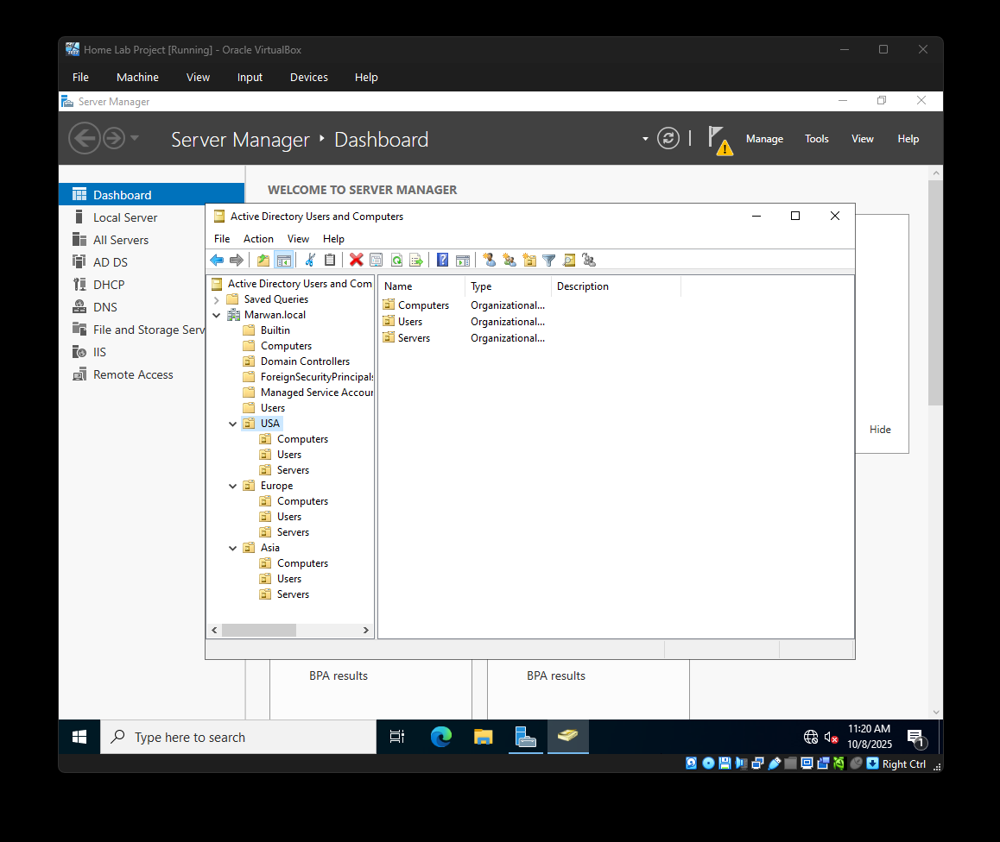
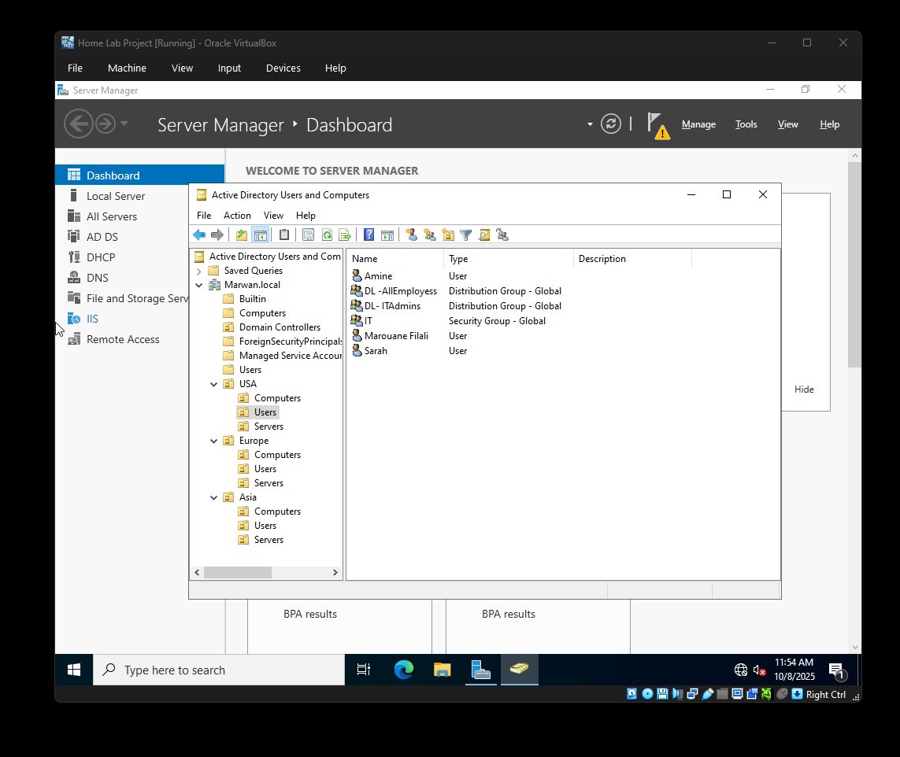
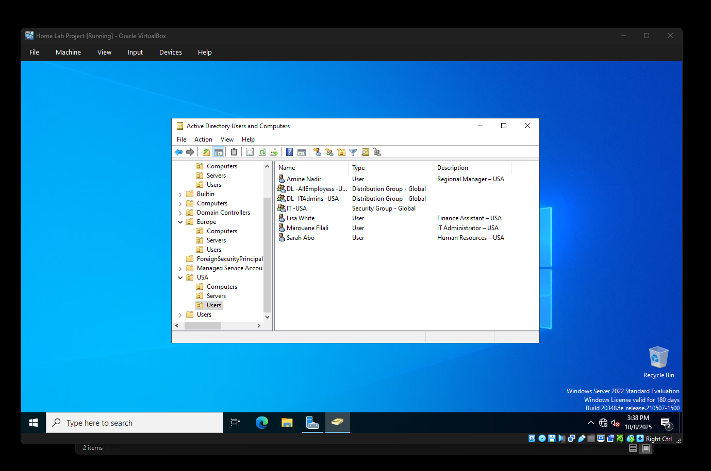
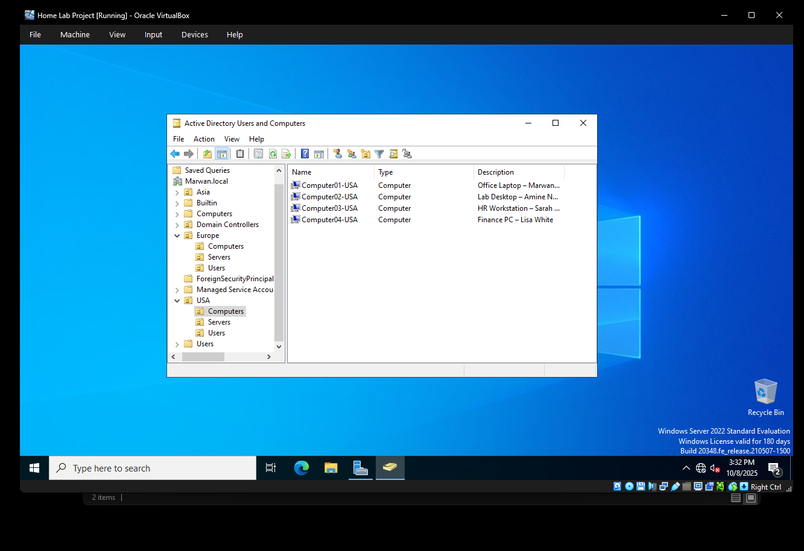
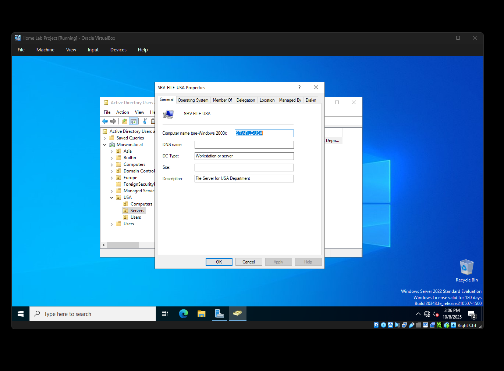
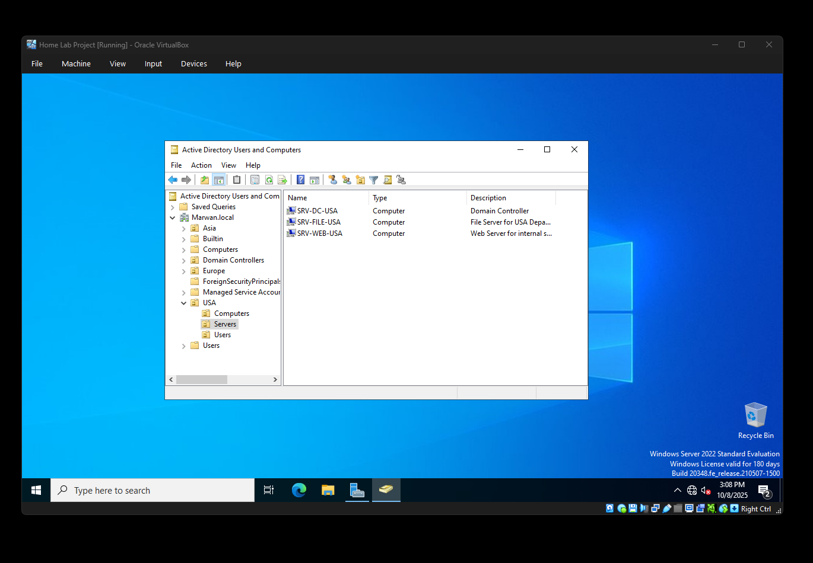
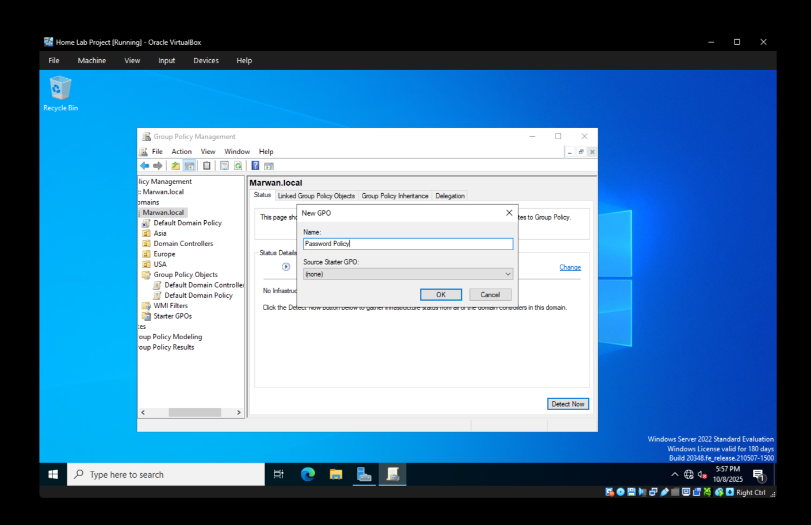
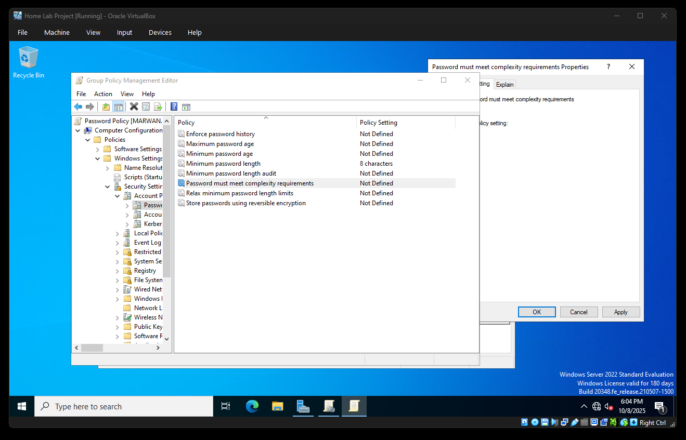
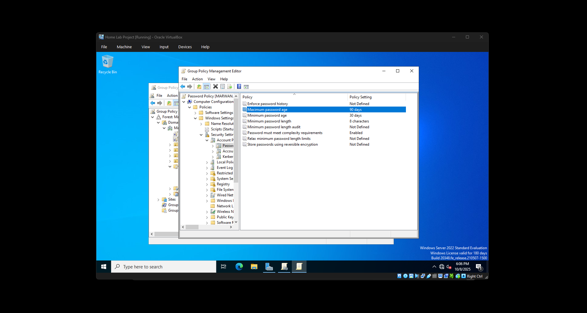
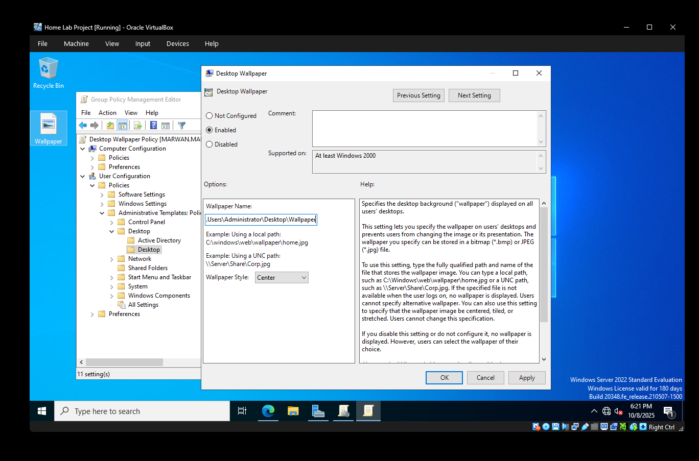
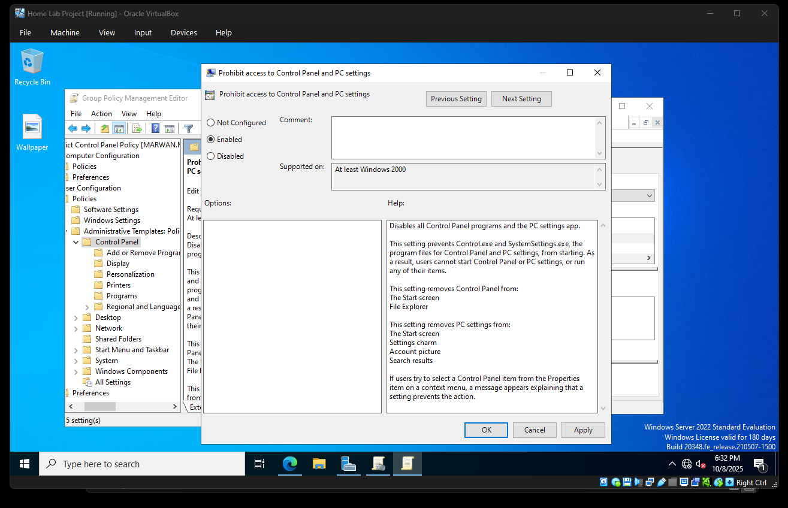
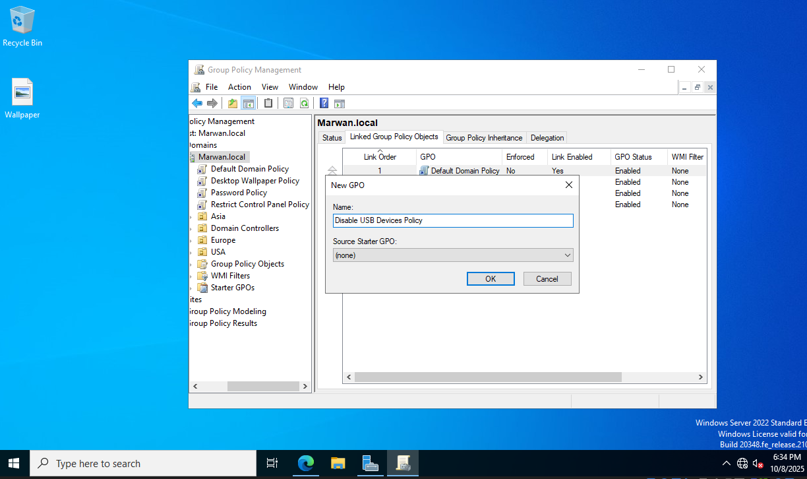
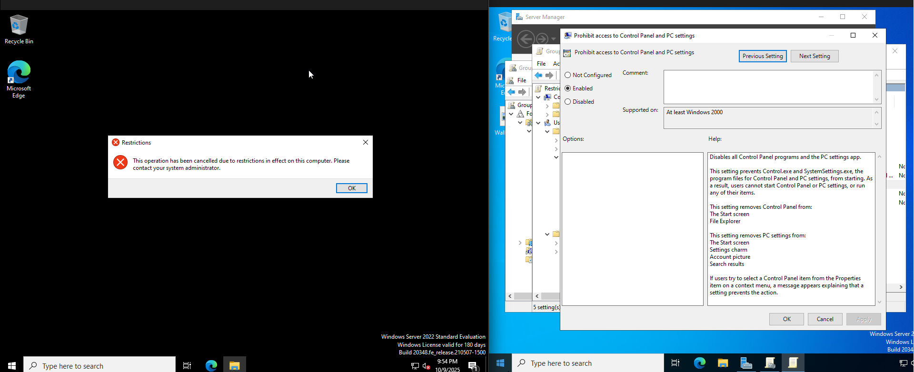
